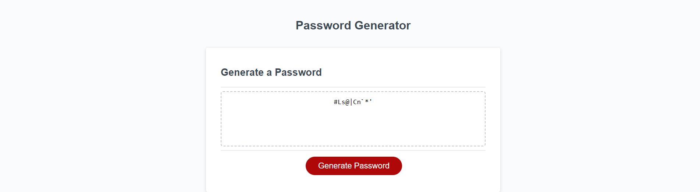

# Password-Generator
A JS based application that generates a random password for the user based on qualifications submitted. When arriving on the webpage you see a "Generate Password" button and when pressed you will be prompted to give a password length between 8-128. The user is given the option of whether they would like any or all of the charecter types. Finally the password will be displayed on the webpage meeting the users qualifications. 

##ScreenShot

###Deployment 

https://mhengerer.github.io/Password-Generator/